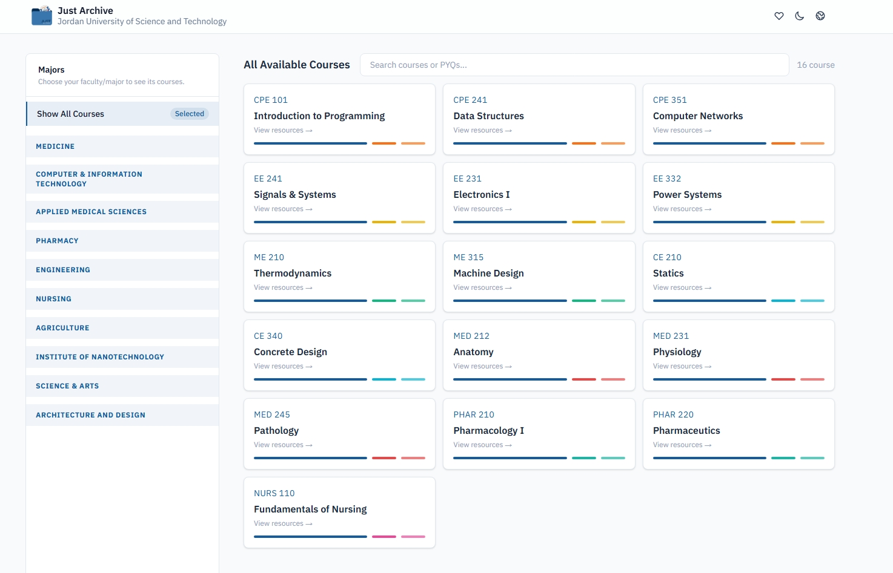
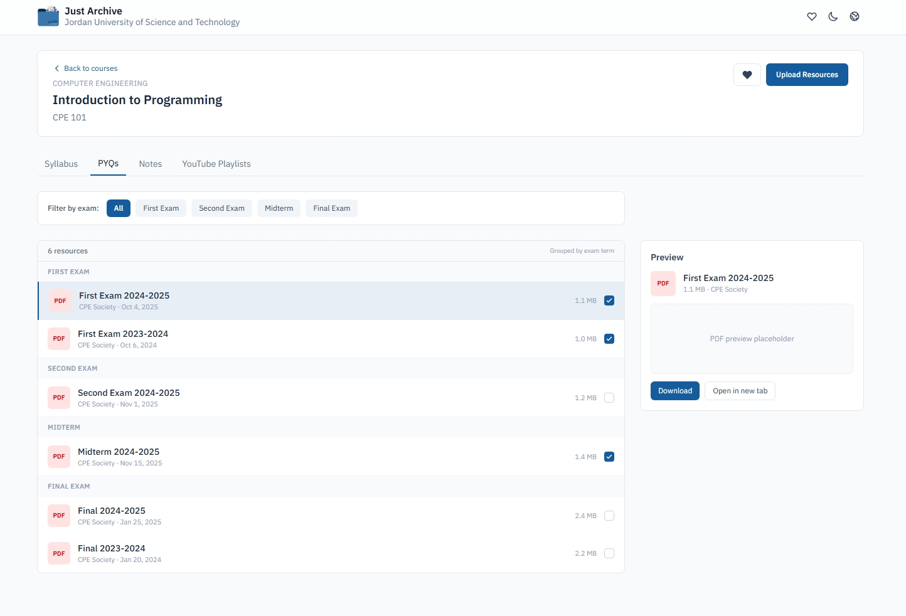

# Just Archive

A unified platform for **all majors** at Jordan University of Science and Technology (JUST) to access and share academic materials, notes, and resources.


<div align="center">
  
  

  > **Note:** This project is currently under development. The [files](https://justarchive.rknastenka.com/) you see are only placeholders for now.
</div>

---

## Features

- 📚 Centralized academic resource repository for all JUST majors
- 🔎 Search and discover course materials easily
- 💾 Upload and share notes, past exams, and study guides
- ⭐ Rate and review resources for quality assurance
- 🌐 Multi-language support (English & Arabic)

## Try It Out

**Live Site:** [justarchive.rknastenka.com](http://justarchive.rknastenka.com/)

## Getting Started (Development)

### Prerequisites

- Node.js 18+
- npm or yarn

### Installation

```bash
git clone https://github.com/rknastenka/Just-Archive.git
cd Just-Archive
npm install
npm run dev
```

Open [http://localhost:3000](http://localhost:3000) in your browser.

---
**We believe in open collaboration and sharing knowledge! This project uses a dual licensing approach to protect both the code and the educational materials:**
- **Code Files:** Licensed under GPL v3 (all modifications and versions must remain open-source).
- **Resources / Files / Notes:** Licensed under CC BY-NC 4.0 (you can share the material but not sell it).
