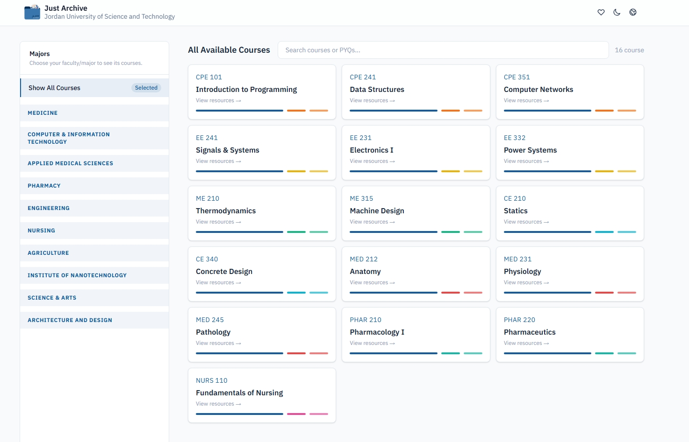
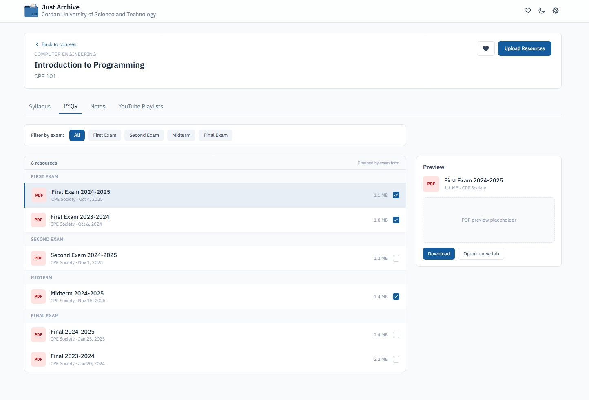

# Just Archive

A centralized, open-source academic repository designed for students across **all majors** at Jordan University of Science and Technology (JUST) to discover, upload, and share course notes, past exams, and study materials.




> **Note:** This project is currently under active development. Placeholder files are in place during current testing.

---

## 📌 Project Purpose

University study resources are often fragmented across private drives, chats, and student groups, making them hard to locate and preserve. **Just Archive** provides a single platform where students can search materials by major and course code, share their own notes, and rate community uploads to maintain resource quality.

---

## 🛠 Technology Stack

* **Frontend & Framework:** Next.js (React), Tailwind CSS
* **Language:** TypeScript / JavaScript
* **Database & Storage:** Supabase (PostgreSQL) for user auth, metadata, and cloud file storage
* **Runtime & Package Manager:** Node.js (v18+), npm

---

## 📂 Project Architecture & Key Files

```text
just-archive/
├── app/                  # Next.js App Router (pages and layouts)
│   ├── layout.tsx        # Application root layout and global metadata
│   ├── page.tsx          # Main entry point (landing page & search)
│   ├── courses/          # Major & course catalog browsing routes
│   └── api/              # Backend API routes (file uploads, user auth)
├── components/           # Reusable UI components (Navbar, ResourceCard, SearchBar)
├── lib/                  # Utilities, helper functions, and Supabase client config
├── public/               # Static assets (images, icons)
├── package.json          # Dependency definitions and run scripts
└── .env.example          # Environment variable template
```

### Important Files to Explore

* `app/page.tsx`: The primary **entry point** and landing page that loads the search bar and featured courses.
* `app/layout.tsx`: Root application shell containing global providers, the navbar, and base styling.
* `lib/supabaseClient.ts`: Core database configuration and client initialization.
* `app/api/upload/route.ts`: API route handling resource uploads and file metadata persistence.

---

## 🚀 Getting Started & How to Run

### Prerequisites

* Node.js 18.x or higher
* npm or yarn

### Local Setup Steps

1. Clone the repository:
git clone https://github.com/rknastenka/Just-Archive.git
cd Just-Archive

2. Install dependencies:
npm install

3. Configure environment:
cp .env.example .env.local

4. Launch development server (Entry Point Trigger):
npm run dev

5. Open http://localhost:3000 in your browser.

---

## 📄 Licensing

* **Codebase:** Licensed under [GPL v3](LICENSE).
* **Uploaded Educational Materials:** Licensed under [CC BY-NC 4.0](https://creativecommons.org/licenses/by-nc/4.0/).
